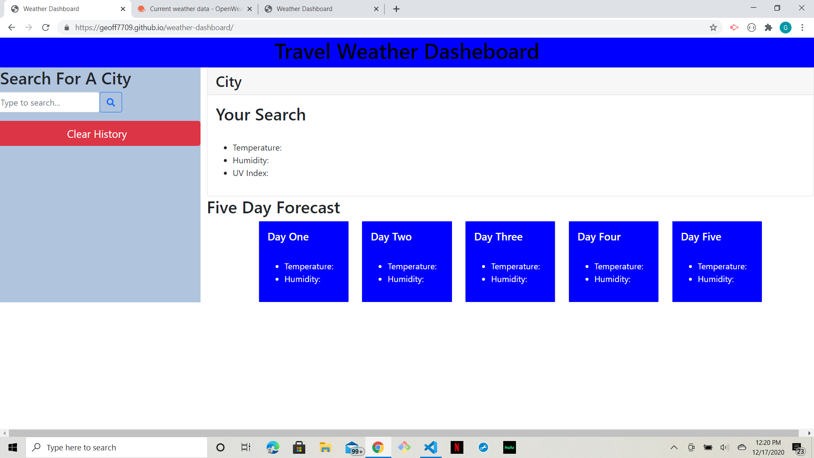
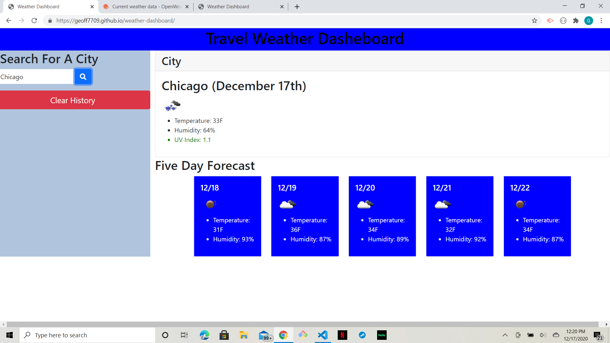
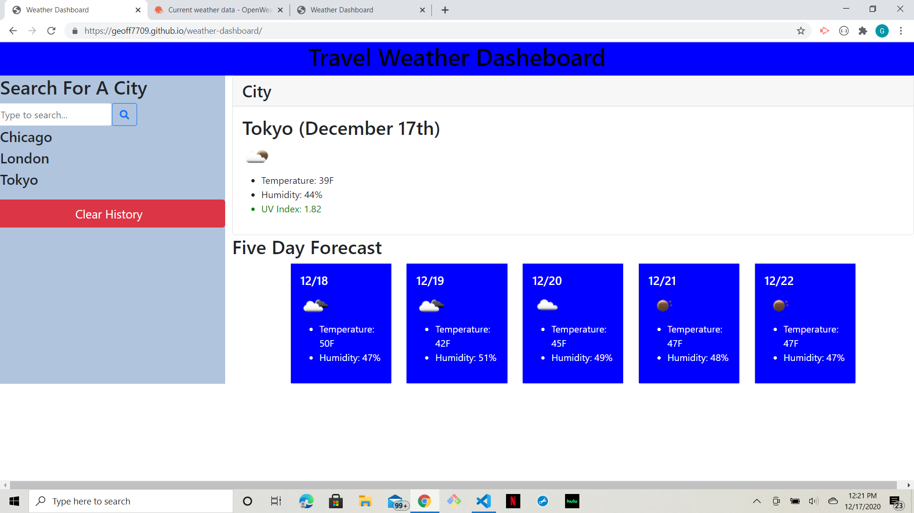

# Weather Dashboard
[Application Site](https://geoff7709.github.io/weather-dashboard/)

## Goals:
When journeying abroad one of the main concerns facing a traveler is the weather at their chosen destination. To help aleviate this uncertainty the application presented uses weather data from across the globe to keep travelers up to date on the conditions they are entering. Also for extended stays the application provides information on any changes be they small or drastic.

## User Story:
Upon first use of the application the user is presented with a blank slate:

With their first search they recieve the weather matching their search input along with a color-coded UV index and a five day forecast organized by date:

After subsequent searches, the user's history is stored. Upon reloading the application, their search history is displayed beneath the search bar, and the page is populated with the data from their most recent search:

The user is also supplied with an option to clear their history which renders the blank slate mode once again. This also clears local storage for further use.

## Use:
The benefits of this application are apparent. Not only does it supply the user with a reliable snapshot of weather upon search (be it local or abroad), it gives useful immediate information in the event of severe weather changes. Whether you need to back shorts, extra warm socks, or cancel your trip altogether due to inclemment conditions, this applications serves as resource for your travel planning needs.

---
## References
[Link](references/references.txt)